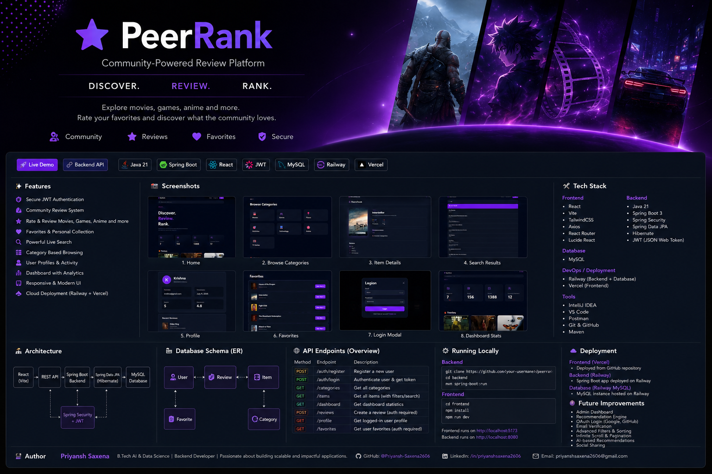
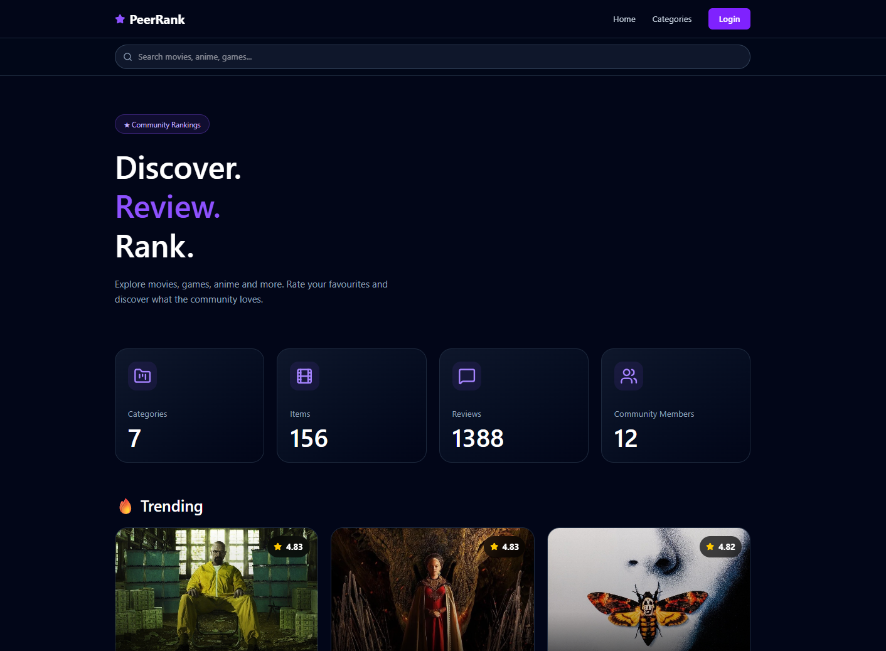
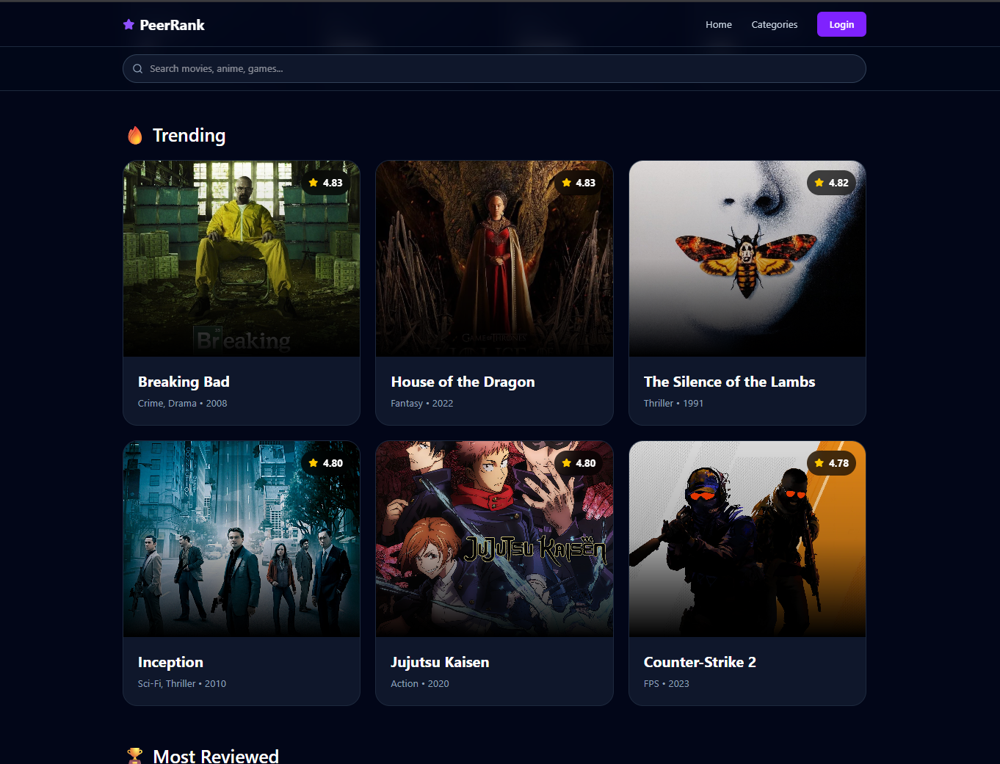
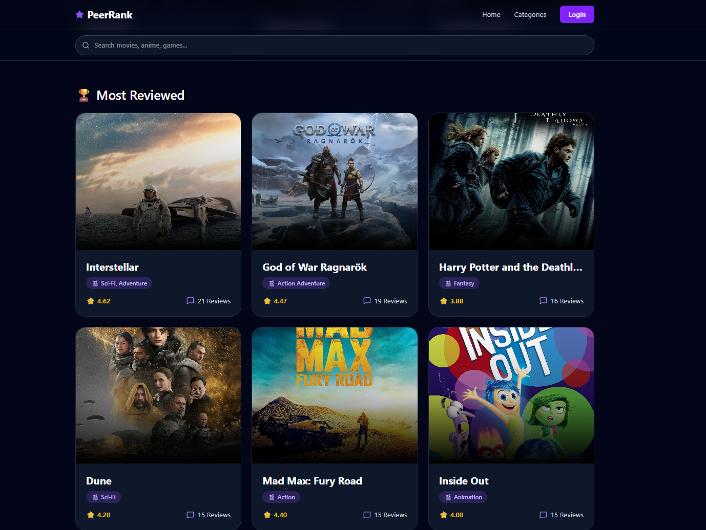
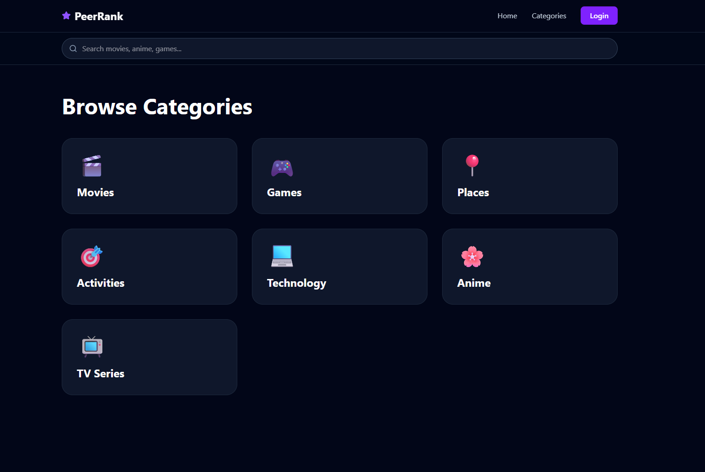
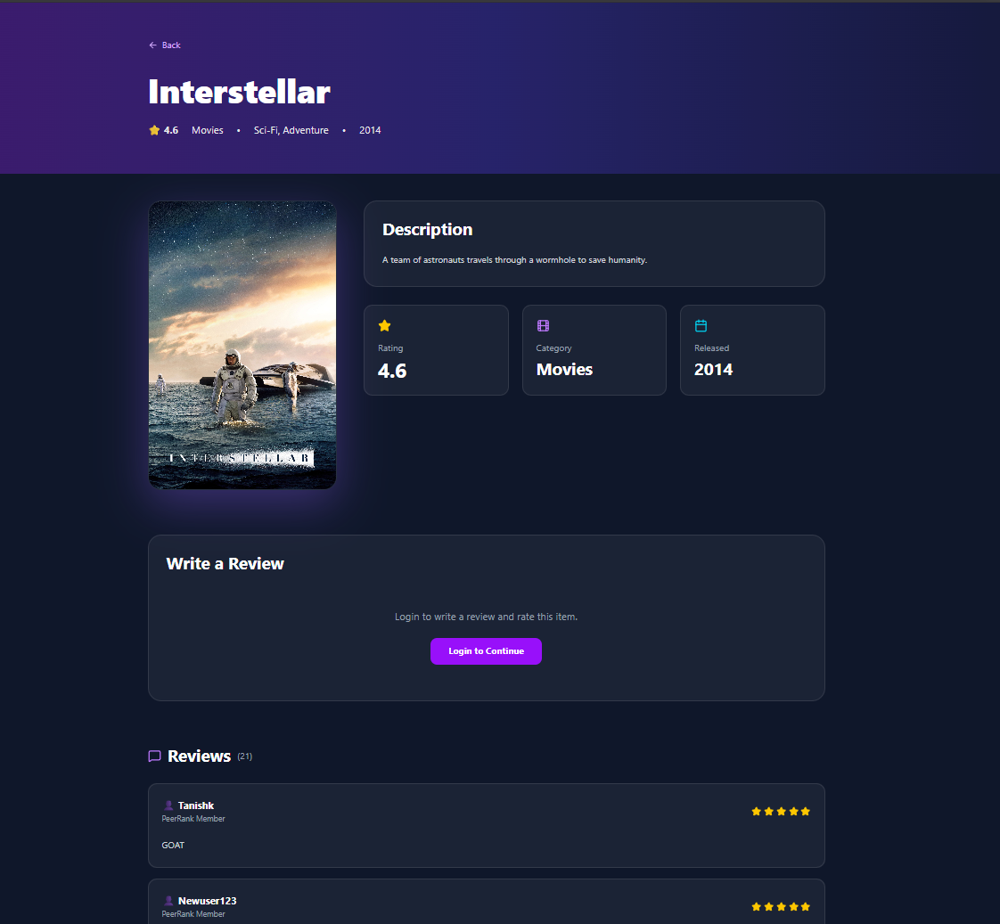
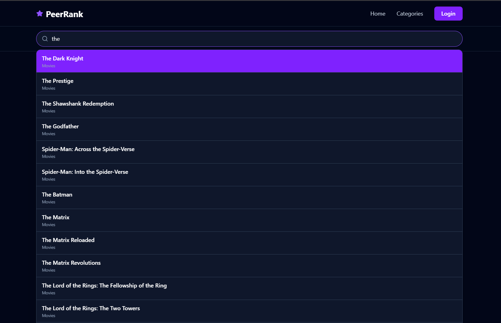
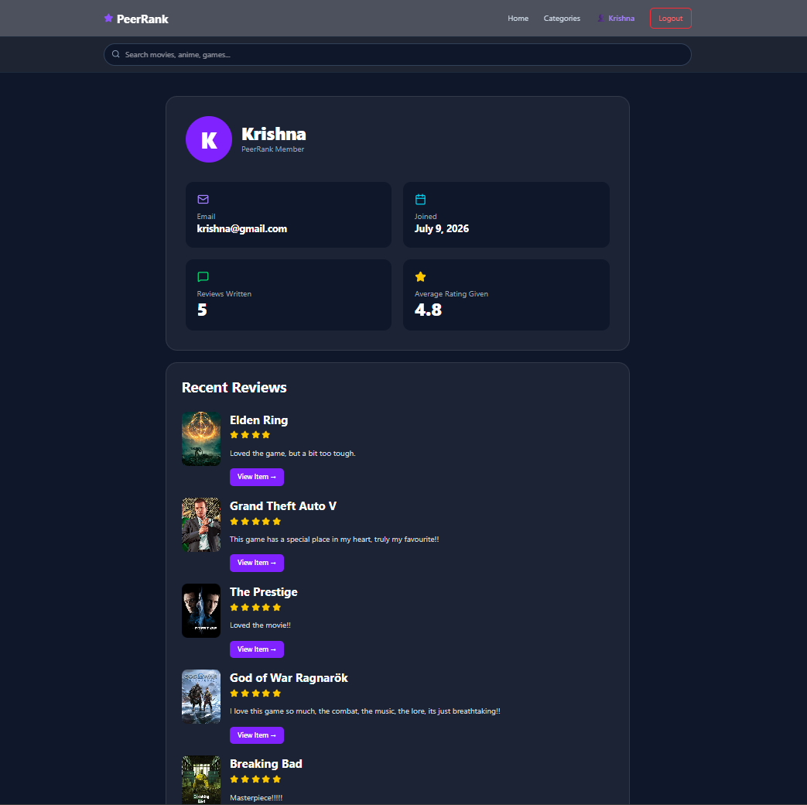
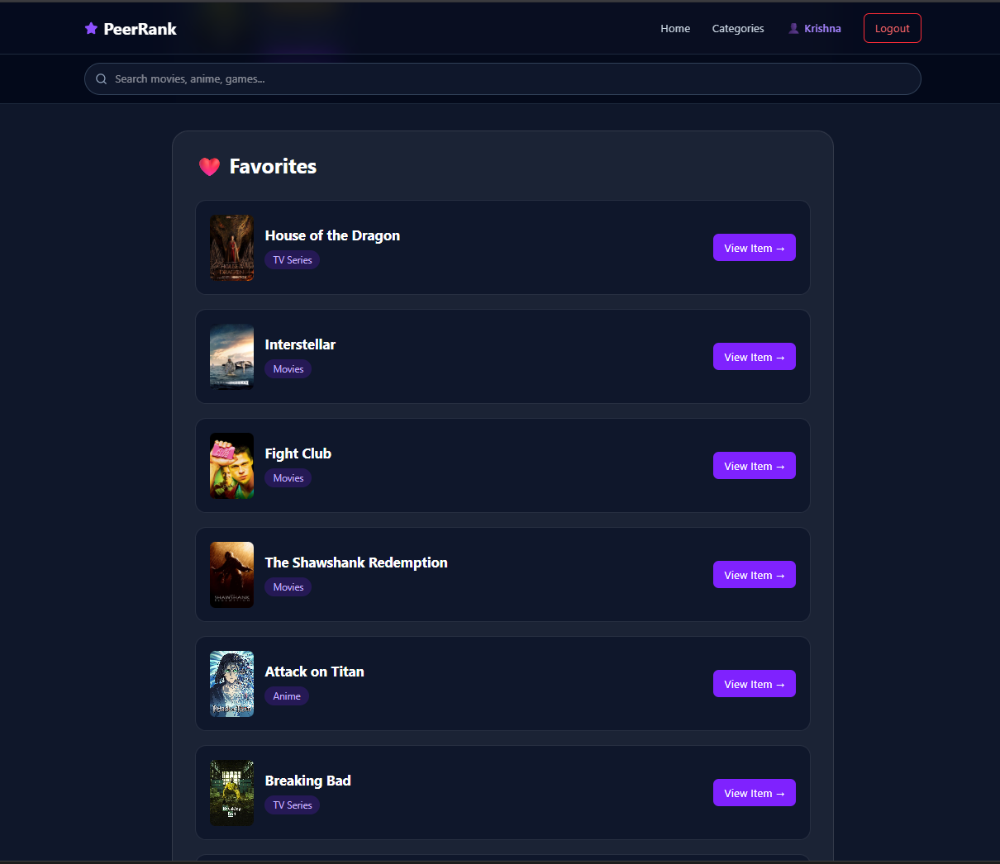
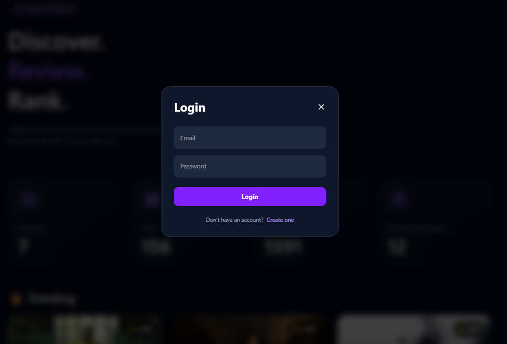

<p align="center">
  
</p>

<h1 align="center">⭐ PeerRank</h1>

<p align="center">
Community-driven review platform inspired by IMDb and MyAnimeList.
</p>

<p align="center">

<a href="https://peer-rank-eta.vercel.app">

</a>

<a href="https://peerrank-production.up.railway.app/">

</a>

<a href="https://github.com/Priyansh-Saxena2606/PeerRank">

</a>

</p>

<p align="center">


</p>

---

# 📖 About

PeerRank is a full-stack review platform where users can discover, review, rate and organize their favourite content across multiple categories.

Inspired by platforms like **IMDb** and **MyAnimeList**, PeerRank allows users to browse Movies, TV Series, Anime, Games, Technology, Places and Activities, while contributing ratings and reviews that shape community rankings.

The application is built using a modern Spring Boot backend secured with JWT Authentication and a responsive React frontend deployed on Vercel.

---

# ✨ Features

- 🔐 Secure JWT Authentication
- ⭐ Community Rating & Review System
- ❤️ Personal Favorites Collection
- 👤 Personalized User Profiles
- 🔍 Real-Time Search
- 📈 Trending Items
- 🏆 Most Reviewed Rankings
- 🎮 150+ Items across 7 Categories
- 📊 Dashboard Statistics
- 📱 Responsive UI
- ☁ Railway + Vercel Deployment

---

# 📸 Screenshots

## 🏠 Home

<p align="center">

</p>

---

## 🔥 Trending

<p align="center">

</p>

---

## 🏆 Most Reviewed

<p align="center">

</p>

---

## 📂 Browse Categories

<p align="center">

</p>

---

## 🎮 Item Details

<p align="center">

</p>

---

## 🔍 Live Search

<p align="center">

</p>

---

## 👤 User Profile

<p align="center">

</p>

---

## ❤️ Favorites

<p align="center">

</p>

---

## 🔑 Login

<p align="center">

</p>

---

# 🏗 Architecture

```text
                    React + Vite
                          │
                     Axios REST API
                          │
                  Spring Boot Backend
                          │
             Spring Security + JWT
                          │
                  Spring Data JPA
                          │
                     Hibernate ORM
                          │
                    Railway MySQL
```

---

# 🛠 Tech Stack

## Frontend

- React
- Vite
- Tailwind CSS
- React Router
- Axios
- Lucide React

## Backend

- Java 21
- Spring Boot 3
- Spring Security
- Spring Data JPA
- Hibernate
- JWT Authentication

## Database

- MySQL

## Deployment

- Railway
- Vercel

# 📂 Project Structure

```text
PeerRank
│
├── peerrank                 # Spring Boot Backend
│   ├── controller
│   ├── service
│   ├── repository
│   ├── entity
│   ├── dto
│   ├── mapper
│   ├── security
│   └── config
│
├── peerrank-frontend        # React Frontend
│   ├── components
│   ├── pages
│   ├── services
│   ├── api
│   ├── context
│   └── assets
│
├── database
│
├── assets
│   ├── banner.png
│   └── screenshots
│
└── README.md
```

---

# 🌐 REST API Overview

| Method | Endpoint | Description |
|---------|----------|-------------|
| POST | `/auth/register` | Register a new user |
| POST | `/auth/login` | Authenticate user |
| GET | `/dashboard` | Dashboard statistics |
| GET | `/categories` | Fetch all categories |
| GET | `/items` | Fetch all items |
| GET | `/items/{id}` | Fetch item details |
| GET | `/reviews/item/{id}` | Fetch reviews for an item |
| POST | `/reviews` | Create a review |
| GET | `/users/me` | Current user profile |
| GET | `/favorites` | User favorites |

---

# ⚙️ Running Locally

## 1. Clone Repository

```bash
git clone https://github.com/Priyansh-Saxena2606/PeerRank.git

cd PeerRank
```

---

## 2. Backend Setup

```bash
cd peerrank

mvn clean install

mvn spring-boot:run
```

Backend runs on

```text
http://localhost:8080
```

---

## 3. Frontend Setup

```bash
cd peerrank-frontend

npm install

npm run dev
```

Frontend runs on

```text
http://localhost:5173
```

---

# ☁️ Deployment

| Component | Platform |
|-----------|----------|
| Frontend | Vercel |
| Backend | Railway |
| Database | Railway MySQL |

---

# 🔒 Security

- JWT Authentication
- BCrypt Password Encryption
- Spring Security
- Stateless Authentication
- Protected User Endpoints
- Environment Variable based configuration
- CORS Configuration for Production

---

# 📊 Current Statistics

- 🎮 **150+ Items**
- ⭐ **1000+ Community Reviews**
- ❤️ Favorites System
- 👤 User Profiles
- 🔍 Instant Search
- 📈 Trending Algorithm
- 🏆 Most Reviewed Ranking
- 🎯 7 Content Categories

---

# 🚀 Future Improvements

- Role-based Admin Dashboard
- Advanced Sorting & Filtering
- Recommendation Engine
- OAuth Login (Google/GitHub)
- Email Verification
- Notification System
- Review Likes & Comments
- User Activity Feed

---

# 💻 Tech Highlights

- Layered Architecture
- DTO Pattern
- Entity Mapping
- RESTful API Design
- JWT Authentication
- Responsive UI
- Production Deployment
- Clean Code Structure

---

# 🙌 Acknowledgements

This project was inspired by platforms such as:

- IMDb
- MyAnimeList
- Letterboxd

while implementing a modern full-stack architecture using Spring Boot and React.

---

# 👨‍💻 Author

## Priyansh Saxena

Backend Developer | Java | Spring Boot | React

---

### ⭐ If you enjoyed this project, consider giving it a Star!

It motivates me to continue building and improving open-source projects.
